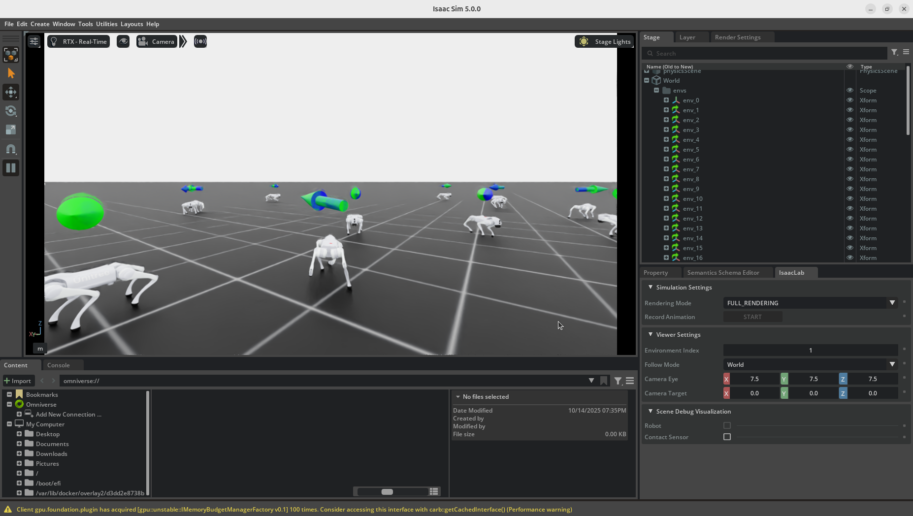

[](https://isaac-sim.github.io/IsaacLab/)
[](https://docs.isaacsim.omniverse.nvidia.com/latest/index.html)
[](https://docs.python.org/3/whatsnew/3.11.html)
[](https://releases.ubuntu.com/22.04/)
[](https://opensource.org/licenses/BSD-3-Clause)

# Lidar integration [BETA]


## Overview

<p style="font-size: 1.2rem;"> This project is a part of the [go2_isaaclab](#https://github.com/SamS709/go2_lidar) project which aims to make a Sim2Real for Unitree Go2 quadruped locomotion </p>

The goal of this repo is to add the lidar of the go2 as a perception module so that the robot can walk on rough environments. This is done by adding the observations of the 3D lidar that comes with the robot.

**Key Features:**

1) [**Training**](#1-training)
    - A policy for go2 robot using direct based environnement. The policy follows the commands sent by the user: linear (x/y) velocitiezs // angular (z) velocity // base height.
2) [**Sim2Sim**](#2-sim2sim)
    - Sim2Sim in Huro environment (github of a researcher at LORIA).
3) [**Sim2Real**](#3-sim2real)
    - Sim2Real in huro using ros2.


## Installation

- Install **Isaac Lab** following the [official installation guide](https://isaac-sim.github.io/IsaacLab/main/source/setup/installation/pip_installation.html) (tested with **Isaac Sim 5.1.0** and **Isaac Lab v2.3.1**).

- Clone or copy this project/repository separately from the Isaac Lab installation (i.e. outside the `IsaacLab` directory):
  
    ```bash
    git clone https://github.com/SamS709/go2_lidar.git
    ```
  
- Using a python interpreter that has Isaac Lab installed, install the library in editable mode using:

    ```bash
    cd go2_isaaclab
    python -m pip install -e source/go2_lidar
    ```

## 1) Training

To see how the lidar observations are computed, go to [lidar_info.md](lidar_info.md).

### a) Train

Make sure you are in your the classic Isaac Lab Python environment (not the Newton branch).

- Train the Go2 locomotion environment:

    ```bash
    cd go2_lidar
    python scripts/rsl_rl/train.py --task Isaac-Velocity-Rough-Go2-Lidar-Direct-v0 --num_envs 4096 --headless
    ```

### b) Test

- Run the trained policy :

    ```bash
    python scripts/rsl_rl/play.py --task Isaac-Velocity-Rough-Go2-Lidar-Direct-v0 --num_envs 512
    ```

- Control the robot with the keyboard (here, a pretrained checkpoint is used for convenience):

    ```bash
    python scripts/control/go2_locomotion.py --checkpoint pretrained_checkpoint/pretrained_checkpoint.pt --visualize
    ```

    

    Controls:

  - **Up/Down arrows**: Increase/decrease the robot's forward/backward velocity (x-axis)
  - **Left/Right arrows**: Increase/decrease the robot's left/right velocity (y-axis)
  - **F/G keys**: Increase/decrease the robot's angular velocity (yaw rotation)

## 2) Sim2Sim

Using HURO repository.
Simulated in gazebo.

See the instructions given [here](https://github.com/hucebot/huro/tree/sami).

The result (for the moment):


## 3) Sim2Real