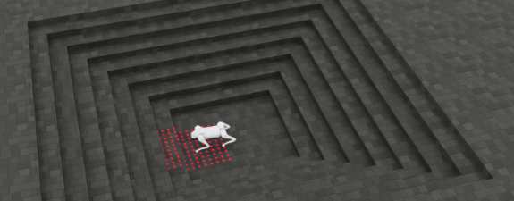
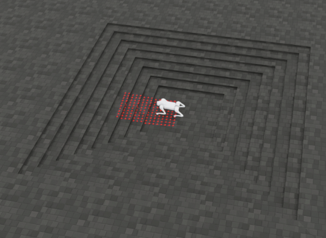
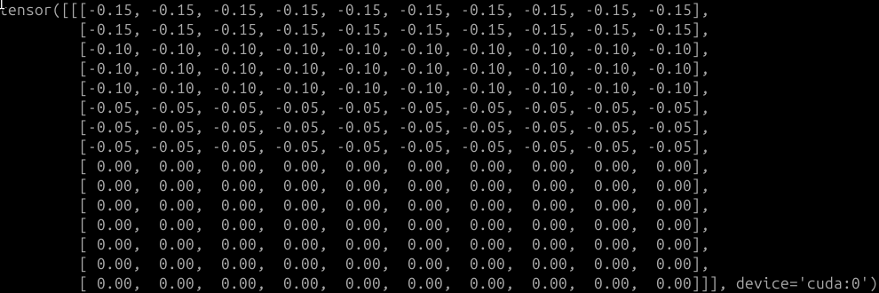

Informations about the lidar in simulation and in real life

1. In simulation:

The lidar is positionned (translation) where it is in real life.
It is not rotated, so it cant detect higher than where it in positioned in z axis in any direction. (as opposed to real robot that detects higher objects in front of him and lower behid him bc it is rotated along yaw)
So, the data in simulation has this form (x and y are given in the lidar frame):

```
      
        y = -0.45   y = -0.35   y = -0.25   y = -0.15   y = -0.05    y = 0.05    y = 0.15    y = 0.25    y = 0.35    y = 0.45        
          
tensor([
        [[ 0.00,       0.00,       0.00,       0.00,       0.00,       0.00,       0.00,       0.00,       0.00,       0.00],         x = 0.95
         [ 0.00,       0.00,       0.00,       0.00,       0.00,       0.00,       0.00,       0.00,       0.00,       0.00],         x = 0.85
         [ 0.00,       0.00,       0.00,       0.00,       0.00,       0.00,       0.00,       0.00,       0.00,       0.00],         x = 0.75
         [ 0.00,       0.00,       0.00,       0.00,       0.00,       0.00,       0.00,       0.00,       0.00,       0.00],         x = 0.65
         [ 0.00,       0.00,       0.00,       0.00,       0.00,       0.00,       0.00,       0.00,       0.00,       0.00],         x = 0.55
         [-0.13,      -0.13,      -0.13,      -0.13,      -0.13,      -0.13,      -0.13,      -0.13,      -0.13,      -0.13],         x = 0.45
         [-0.13,      -0.13,      -0.13,      -0.13,      -0.13,      -0.13,      -0.13,      -0.13,      -0.13,      -0.13],         x = 0.35
         [-0.13,      -0.13,      -0.13,      -0.13,      -0.13,      -0.13,      -0.13,      -0.13,      -0.13,      -0.13],         x = 0.25
         [ 0.00,       0.00,       0.00,       0.00,       0.00,       0.00,       0.00,       0.00,       0.00,       0.00],         x = 0.15
         [ 0.00,       0.00,       0.00,       0.00,       0.00,       0.00,       0.00,       0.00,       0.00,       0.00],         x = 0.05
         [ 0.00,       0.00,       0.00,       0.00,       0.00,       0.00,       0.00,       0.00,       0.00,       0.00],         x = -0.05
         [ 0.00,       0.00,       0.00,       0.00,       0.00,       0.00,       0.00,       0.00,       0.00,       0.00],         x = -0.15
         [ 0.00,       0.00,       0.00,       0.00,       0.00,       0.00,       0.00,       0.00,       0.00,       0.00],         x = -0.25
         [ 0.00,       0.00,       0.00,       0.00,       0.00,       0.00,       0.00,       0.00,       0.00,       0.00],         x = -0.35
         [ 0.00,       0.00,       0.00,       0.00,       0.00,       0.00,       0.00,       0.00,       0.00,       0.00]]         x = -0.45
         ], device='cuda:0')
```

This corresponds to this picture in the Simulation:

 

The zeros for x>0.45 corresponds to points that the lidar doesnt detect bc they are higher than its position in the simulation.

Indeed, here is a picture and the corresponding heightmap for lower stairs

  

